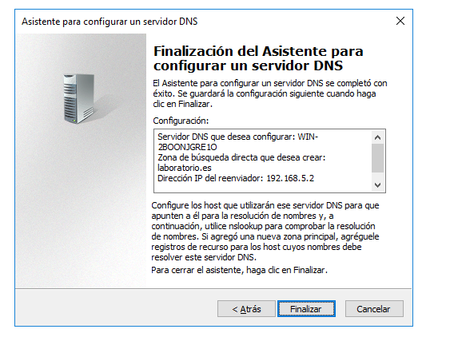

# Laboratorio

La empresa consta de un laboratorio, está compuesta por 3 departamentos. El primer departamento está formado por los administradores llamados José Miguel y María en el cuál podrán acceder las 24/7 al equipo EAdministradores. El segundo departamento estará formado por médicos llamados Juan y Rodrigo los cuáles solo podrá acceder al equipo EMedicos de Lunes a Viernes a partir de las 9:00 hasta las 15:00. El tercer y último departamento está formado por dos investigadores llamados Pedro y Lucía los cuáles solo podrán acceder de 9:00 hasta las 15:00 de Lunes a Viernes en el equipo EInvestigadores. Los usuarios/equipos de los departamentos estarán dentro de sus respectivos grupos, los equipos de los médicos e investigadores estarán administrados por el grupo Administrativos. Cada grupo de usuarios tendrá su propia carpeta en donde solo ellos podrán acceder y modificar ya que cada carpeta tiene sus propios permisos.

El servidor de Windows 2016 en donde están instalados el servidor DHCP con un rango de dominio de 192.168.5.100 a 192.168.5.200, el servidor DNS que será laboratorio.es, para la comprobación del funcionamiento de estos se ha instalado un servidor IIS para que al intentar acceder desde otra máquina virtual nos visualice la página laboratorio.es. 

## CAPTURAS

### DHCP

### DNS

### UNIDAD ORGANIZATIVA

